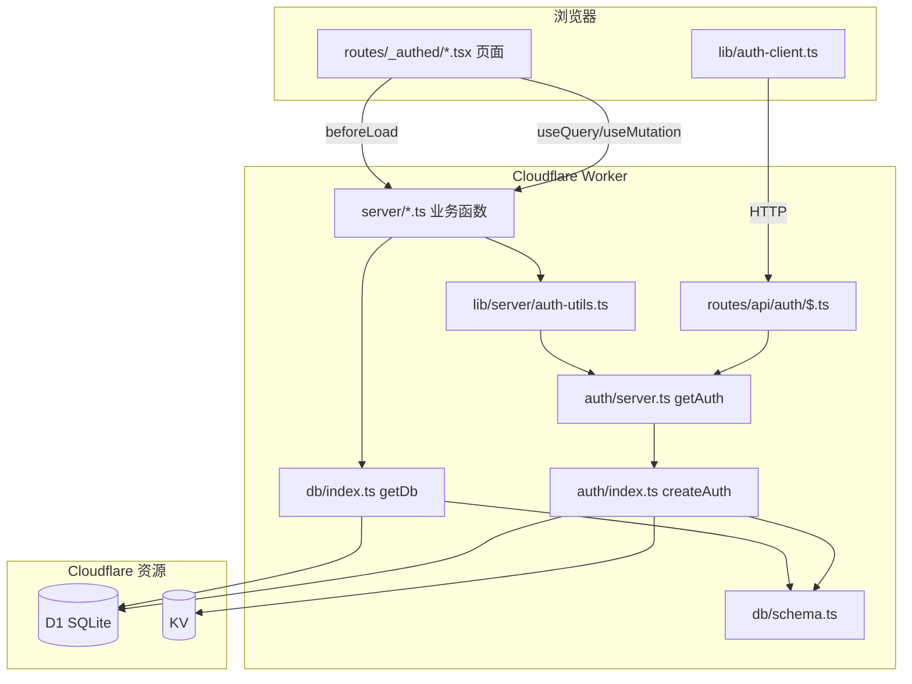

# 技术栈与架构

本文梳理 Job Manager 的技术选型、各模块的依赖关系，以及背后的设计取舍，方便快速理解整个工程为什么这样运转。

> **一句话定位**：这是一个跑在 Cloudflare Workers 上的个人/小团队工作台，核心诉求是「**部署简单、边缘低延迟、按需付费、零运维**」。下面所有技术选型都是围绕这个诉求展开的——优先选 Cloudflare 原生能力（Workers/D1/KV），并用类型安全的全栈框架把前后端收敛到一套代码里。
>
> **贯穿全文的三条设计原则**：
>
> 1. **单一可信源**：配置（`auth/index.ts`）、数据（D1）、Schema（`db/schema.ts`）都只有一份来源，避免运行时/CLI、前端/后端各执一套。
> 2. **按用户隔离**：所有业务数据读写强制带 `userId`，隔离逻辑统一收口在服务端，UI 无从绕过（原理与「不这么做会怎样」详见 [用户数据隔离（user_id）说明](./用户数据隔离（user_id）说明.md)）。
> 3. **权威源与缓存分离**：持久数据放 D1（账本），可丢的快状态放 KV（便签）。

---

## 1. 技术栈总览

| 领域     | 选型                                                 | 说明                                                             |
| -------- | ---------------------------------------------------- | ---------------------------------------------------------------- |
| 框架     | **TanStack Start**（React 19 + TypeScript）          | 全栈 SSR 框架，文件式路由 + Server Functions                     |
| 编译优化 | **React Compiler**（`babel-plugin-react-compiler`）  | 构建期自动 memo 化，免手写 `useMemo`/`useCallback`/`memo`        |
| 路由     | **TanStack Router**                                  | 类型安全的文件路由，`src/routes/` 下自动生成 `routeTree.gen.ts`  |
| 数据请求 | **TanStack Query**                                   | 客户端缓存 / 重新拉取，配合 SSR 集成                             |
| 运行平台 | **Cloudflare Workers**                               | 通过 `@cloudflare/vite-plugin` 构建与本地模拟                    |
| 数据库   | **Cloudflare D1**（SQLite）+ **Drizzle ORM**         | 业务数据与 better-auth 关系表                                    |
| 会话存储 | **Cloudflare KV**                                    | better-auth 的 `secondaryStorage`（session、限流）               |
| 认证     | **better-auth** + `better-auth-cloudflare`           | 邮箱 + 密码，多用户                                              |
| 构建     | **Vite 7**                                           | 插件链：devtools → cloudflare → tailwind → tanstackStart → react |
| 样式     | **Tailwind CSS v4** + **shadcn/ui**（new-york 风格） | UI 组件在 `src/components/ui/`                                   |
| 图标     | **lucide-react**                                     |                                                                  |
| 通知     | **sonner**                                           | Toast                                                            |
| 主题     | 自实现（`src/lib/theme.ts`）+ `next-themes`          | 深 / 浅色，hydration 前内联脚本防闪烁                            |
| 测试     | **Vitest** + Testing Library + jsdom                 |                                                                  |
| 代码规范 | ESLint（`@tanstack/eslint-config`）+ Prettier        |                                                                  |

**为什么是这套组合：**

- **TanStack Start 而非 Next.js**：要的是「文件路由 + Server Functions」这种前后端同构、类型贯通的体验，且能直接编译成单个 Worker 部署，不依赖 Node server。路由、数据请求（Query）、表单都来自同一 TanStack 生态，心智一致。
- **启用 React Compiler**：React 19 配套的编译器在构建期自动做记忆化（memoization），开发者不必再手写 `useMemo`/`useCallback`/`React.memo` 来防重渲染，代码更干净、也更不容易漏写优化。本项目通过 `vite.config.ts` 里 `viteReact` 的 babel 插件 `babel-plugin-react-compiler`（`target: '19'`）接入，对所有组件默认生效。
- **Cloudflare Workers 而非传统服务器**：边缘运行、冷启动近乎为零、按请求计费，对个人项目几乎零成本、零运维。
- **D1 + KV 而非自建数据库 + Redis**：D1（SQLite）和 KV 都是 Workers 原生绑定，免去单独部署和连接管理；恰好对应「需要持久 + 关系查询」和「需要极快 + 可丢」两类需求。
- **better-auth 而非自己写鉴权**：开箱即用的邮箱密码 / 会话 / 限流，并有 `better-auth-cloudflare` 适配层直接把 D1+KV 接上，省掉大量样板与安全坑。

> 关键认知：**better-auth 的用户 / 账号 / 验证等关系数据存在 D1，session 与限流存在 KV**——这是 better-auth 在 Cloudflare 上的标准组合（见 `src/auth/index.ts` 中的 `withCloudflare`）。把会话放 KV 是因为它「写一次读多次、可带 TTL、读取极快」，正好契合每次请求都要校验会话的场景。

---

## 2. 目录结构

```
src/
├── router.tsx                 # 创建 TanStack Router，挂接 Query SSR 集成
├── routeTree.gen.ts           # 由 router-plugin 自动生成（勿手改）
├── styles.css                 # Tailwind + 主题变量
│
├── routes/                    # 文件式路由（页面 + API）
│   ├── __root.tsx             # 根布局：HTML 壳、主题脚本、Toaster、Devtools
│   ├── login.tsx              # 登录 / 注册页（已登录则重定向到 /）
│   ├── _authed.tsx            # 受保护布局：beforeLoad 校验登录，否则跳 /login
│   ├── _authed/
│   │   ├── index.tsx          # 工作台首页（汇总三类数据数量）
│   │   ├── projects.tsx       # 开发中项目
│   │   ├── links.tsx          # Gitlab & Jenkins 链接
│   │   └── accounts.tsx       # 账号体系
│   └── api/auth/$.ts          # better-auth 的 catch-all HTTP 端点
│
├── server/                    # Server Functions（仅服务端执行）
│   ├── session.ts             # fetchCurrentUser
│   ├── projects.ts            # projects 增删改查
│   ├── links.ts               # repo_links 增删改查
│   └── accounts.ts            # account_entries 增删改查
│
├── auth/                      # 认证配置
│   ├── index.ts               # createAuth：运行时 & CLI 共用一份配置
│   └── server.ts              # getAuth：运行时单例（绑定当前 Worker env）
│
├── db/                        # 数据层
│   ├── index.ts               # getDb：drizzle(env.DB)
│   ├── schema.ts              # 合并导出 auth + app schema
│   ├── auth-schema.ts         # better-auth 表（CLI 生成）
│   └── app-schema.ts          # 业务表 projects / repo_links / account_entries
│
├── lib/
│   ├── auth-client.ts         # 浏览器端 better-auth 客户端
│   ├── server/auth-utils.ts   # getCurrentUser / requireUserId（服务端）
│   ├── theme.ts               # 主题读写 + 防闪烁脚本
│   └── utils.ts               # cn() 等工具
│
├── components/
│   ├── ui/                    # shadcn/ui 组件
│   └── theme-toggle.tsx
│
└── integrations/tanstack-query/
    ├── root-provider.tsx      # getContext：创建 QueryClient
    └── devtools.tsx
```

配置文件：`wrangler.jsonc`（Workers/D1/KV 绑定）、`vite.config.ts`（插件链）、`drizzle.config.ts`（迁移生成）、`tsconfig.json`（路径别名 `#/*`、`@/*` → `src/*`）。

---

## 3. 模块依赖关系

### 3.1 分层依赖（自上而下）

```
routes/  (页面 + API 端点 / UI 层)
  │  调用
  ├─────────────► server/  (Server Functions：业务读写)
  │                  │  调用
  │                  ├──► lib/server/auth-utils.ts ──► auth/server.ts ──► auth/index.ts
  │                  └──► db/index.ts ──► db/schema.ts (drizzle)
  │
  ├─────────────► lib/auth-client.ts        (浏览器端登录/登出)
  ├─────────────► components/ui + components/theme-toggle
  └─────────────► integrations/tanstack-query (QueryClient)

api/auth/$.ts ──► auth/server.ts ──► auth/index.ts  (better-auth HTTP handler)

auth/index.ts ──► db/schema.ts        (drizzle adapter 用 schema 定义)
auth/index.ts ──► env.DB / env.KV     (D1 关系数据 + KV 会话)
```

要点（及为什么这样分层）：

- **UI 永远通过 `server/` 的 Server Functions 访问数据库**，不直接 import `db`。
  _为什么_：`db` 依赖 `cloudflare:workers` 的 `env`，只能在服务端运行；强制走 Server Functions 既保证数据库句柄不泄漏到客户端 bundle，也让「鉴权 + 隔离」有唯一入口，不会被某个页面绕过。
- **所有数据读写都先经过 `requireUserId()` 做用户隔离**（每张业务表都有 `userId` 字段 + 索引）。
  _为什么_：多用户共享同一张表，隔离必须由服务端强制而非依赖前端传参；把 `userId` 的获取收口到一个函数，避免某处忘了过滤导致越权读到别人数据。
- `auth/index.ts` 是「单一配置源」：运行时传入 `env` 用 D1+KV；better-auth CLI 不传 `env`，仅用空 drizzle adapter 来生成 schema。
  _为什么_：鉴权规则（可信来源、限流、密码策略）只写一份，避免「运行时一套、生成 schema 一套」漂移导致库表与实际行为对不上。

### 3.2 认证链路

```
浏览器                          Cloudflare Worker
────────                       ────────────────────────────────
auth-client.ts  ──HTTP──►  routes/api/auth/$.ts
(signIn/signUp/                    │
 signOut/useSession)               └─► getAuth().handler(request)
                                          │
                                   auth/index.ts (better-auth)
                                          ├─► D1  (users/sessions/accounts/verifications)
                                          └─► KV  (session 二级存储 + rateLimit)
```

页面侧的鉴权由路由守卫完成：

- `routes/_authed.tsx` 的 `beforeLoad` 调用 `fetchCurrentUser()`（Server Function），未登录 `throw redirect({ to: '/login' })`。
- `routes/login.tsx` 反向守卫：已登录则跳回 `/`。
- 服务端 `getCurrentUser()` 通过 `getAuth().api.getSession({ headers })` 读取当前请求的会话。

### 3.3 数据流（以「开发中项目」为例）

```
projects.tsx (useQuery / useMutation)
   │
   ▼  listProjects / createProject / updateProject / deleteProject  (server/projects.ts)
   │     先 requireUserId() → 再 getDb()
   ▼
Drizzle ORM  ──►  Cloudflare D1 (projects 表，按 userId 过滤)
   │
   ▼  返回数据 → TanStack Query 缓存 → 渲染表格
```

`links` / `accounts` 两个模块结构与之完全一致，分别对应 `repo_links`、`account_entries` 表。

---

## 4. 数据库设计

数据库为 **Cloudflare D1（SQLite）**，通过 **Drizzle ORM** 定义与迁移。Schema 拆成两份并在 `db/schema.ts` 合并导出：

- `auth-schema.ts`：better-auth 的关系表，由 better-auth CLI 生成，**勿手改**。
- `app-schema.ts`：业务表，手写维护。

> **为什么拆两份**：`auth-schema.ts` 的结构由 better-auth 版本决定，升级时要能被 CLI 重新生成覆盖；把它和手写的业务表隔开，CLI 重生成时就不会动到业务表，二者各自演进、互不污染。最后用 `db/schema.ts` 合并，对外仍是「一份 schema」。

迁移由 `drizzle-kit` 生成到 `drizzle/migrations/`（初始迁移 `0000_init.sql`），随 Worker 部署 apply 到 D1。

### 4.1 整体 ER 关系

```
users (better-auth 用户)
 ├──< sessions          (user_id → users.id, ON DELETE CASCADE)
 └──< accounts          (user_id → users.id, ON DELETE CASCADE)
verifications           (独立，邮箱/令牌验证)

业务表（仅逻辑关联 users，未建外键约束，靠 user_id 做隔离）
 projects               (user_id, 索引)
 repo_links             (user_id, 索引)
 account_entries        (user_id, 索引)
```

> 设计取舍：业务表的 `user_id` **不建数据库外键**，仅在应用层通过 `requireUserId()` 保证写入归属、并加 `user_id` 索引做隔离与加速。这样可避免 better-auth 表（CLI 托管）与业务表之间的强耦合，迁移更自由。

### 4.2 better-auth 表（`auth-schema.ts`）

| 表              | 用途                | 关键字段                                                                                                                                   | 关系/约束                                            |
| --------------- | ------------------- | ------------------------------------------------------------------------------------------------------------------------------------------ | ---------------------------------------------------- |
| `users`         | 用户主体            | `id`(PK)、`name`、`email`(unique)、`email_verified`(bool)、`image`、`created_at`/`updated_at`(ms)                                          | —                                                    |
| `sessions`      | 登录会话            | `id`(PK)、`token`(unique)、`expires_at`、`ip_address`、`user_agent`、`user_id`                                                             | `user_id → users.id` 级联删除；`sessions_userId_idx` |
| `accounts`      | 认证凭据/第三方账号 | `id`(PK)、`account_id`、`provider_id`、`password`(凭据 hash)、`access_token`/`refresh_token`/`id_token` 及各自过期时间、`scope`、`user_id` | `user_id → users.id` 级联删除；`accounts_userId_idx` |
| `verifications` | 邮箱验证 / 令牌     | `id`(PK)、`identifier`、`value`、`expires_at`、`created_at`/`updated_at`                                                                   | `verifications_identifier_idx`                       |

要点：

- better-auth 表的时间字段是**毫秒时间戳**（`timestamp_ms`），与业务表的**秒级时间戳**不同。_这不是疏忽_：auth 表精度由 better-auth 生成器决定（会话过期等需要毫秒级），业务表用秒级则更省、足够，两者各自合理，跨表比较时间时需注意单位换算。
- `usersRelations` / `sessionsRelations` / `accountsRelations` 在 schema 中声明了 Drizzle relations，便于关联查询。
- 运行时会话**主要落在 KV**（better-auth `secondaryStorage`），`sessions` 表为 schema 完整性保留。_为什么_：每个请求都要校验会话，走 KV（边缘、读极快、带 TTL）比每次查 D1 更划算；D1 里的 `sessions` 作为持久底账兜底。

### 4.3 业务表（`app-schema.ts`）

三张业务表共享同一套基础字段：

| 字段         | 类型                     | 说明                                       |
| ------------ | ------------------------ | ------------------------------------------ |
| `id`         | `text` PK                | 默认 `crypto.randomUUID()`                 |
| `user_id`    | `text` notNull           | 数据归属，建索引 `<table>_user_idx` 做隔离 |
| `sort_order` | `integer` 默认 0         | 列表手动排序                               |
| `created_at` | `integer`(timestamp，秒) | 默认 `unixepoch()`                         |
| `updated_at` | `integer`(timestamp，秒) | 默认 `unixepoch()`                         |

各表特有字段：

**`projects` — 开发中项目**

| 字段          | 类型                  | 说明                                                         |
| ------------- | --------------------- | ------------------------------------------------------------ |
| `requirement` | text notNull          | 需求（必填）                                                 |
| `project`     | text 默认 ''          | 项目名                                                       |
| `branch`      | text 默认 ''          | 分支                                                         |
| `status`      | text 枚举 默认 `todo` | `todo` \| `developing` \| `testing` \| `deploying` \| `done` |
| `note`        | text 默认 ''          | 备注                                                         |

**`repo_links` — Gitlab & Jenkins 链接**

| 字段         | 类型                    | 说明                             |
| ------------ | ----------------------- | -------------------------------- |
| `group_name` | text notNull            | 仓库/分组名，用于聚合展示        |
| `kind`       | text 枚举 默认 `gitlab` | `gitlab` \| `jenkins` \| `other` |
| `env`        | text 枚举 默认 `none`   | `test` \| `prod` \| `none`       |
| `label`      | text notNull            | 链接显示名                       |
| `url`        | text notNull            | 链接地址                         |

**`account_entries` — 账号体系**

| 字段       | 类型                 | 说明                           |
| ---------- | -------------------- | ------------------------------ |
| `category` | text 默认 `测试账号` | 分类                           |
| `account`  | text notNull         | 账号                           |
| `password` | text 默认 ''         | 密码（明文存储，仅供个人速查） |
| `detail`   | text 默认 ''         | 详细信息（可存 JSON 文本）     |

> 说明：这里的 `password` 是**业务数据**（用户自己记的测试账号密码），需要明文回显，因此明文存储——这与 `accounts` 表里 better-auth 托管的**登录凭据 hash** 完全是两回事，不要混淆。它属于个人工具的有意取舍：方便速查 > 加密强度。

### 4.4 索引与隔离策略

- 每张业务表建 `<table>_user_idx`（在 `user_id` 上），所有查询都以 `user_id` 为前缀过滤，配合索引避免全表扫描。
- 多用户隔离完全在应用层 `server/*.ts` 中通过 `requireUserId()` 强制：**任何读写都先取当前登录用户 id，再带入 `where userId = ?`**。
- 排序统一用 `sort_order`，相同则回退 `created_at`，由前端拖拽/调序写回。

> 为什么必须服务端强制、不做会怎样（含越权 IDOR 示例与代码逐行讲解）：见 [用户数据隔离（user_id）说明](./用户数据隔离（user_id）说明.md)。

---

## 5. 构建与运行时

- **Vite 插件链顺序**（`vite.config.ts`）：`devtools()` → `cloudflare()` → `tailwindcss()` → `tanstackStart()` → `viteReact()`。顺序不是随意的：`devtools` 要最先以便包裹其余插件的行为，`cloudflare` 需在框架插件之前注入 Workers 运行环境与本地模拟，`tanstackStart` 再在此基础上接管 SSR，`viteReact` 处理 JSX 收尾。换序可能导致 SSR/env 注入失效。
- **React Compiler**：`viteReact` 配置了 babel 插件 `['babel-plugin-react-compiler', { target: '19' }]`，在编译期对组件自动插入记忆化逻辑（等价于自动 `useMemo`/`useCallback`/`memo`），减少不必要的重渲染。`target: '19'` 表示按 React 19 运行时生成代码。因此优化发生在构建阶段，运行时无额外开销；日常写组件时无需再手动包记忆化 hook。
- **入口**：`wrangler.jsonc` 的 `main` 指向 `@tanstack/react-start/server-entry`，由 TanStack Start 接管 SSR 与 Server Functions 路由。
- **运行时绑定**：代码中通过 `import { env } from 'cloudflare:workers'` 读取 `env.DB`（D1）与 `env.KV`（KV）。
- **类型**：`worker-configuration.d.ts` 由 Wrangler 生成，提供 `Env` 类型。
- **兼容性**：`compatibility_flags: ["nodejs_compat"]`，部分依赖依赖 Node 兼容层。

---

## 6. 本地开发与数据库

### 6.1 本地数据库怎么跑

本地开发用 `bun run dev`（即 `vite dev --port 3000`）。`@cloudflare/vite-plugin` 会通过 **Miniflare** 在本地模拟 Workers 运行时，并自动给 `env.DB` / `env.KV` 提供本地实现：

- **D1**：本地是一个真实的 SQLite 文件，落在 `.wrangler/state/v3/d1/miniflare-D1DatabaseObject/*.sqlite`，与线上 D1 完全隔离。
- **KV**：同样由 Miniflare 在 `.wrangler/state/` 下用本地存储模拟，不会触碰线上 KV。

所以**本地开发不需要联网、也不会动到生产数据**。

### 6.2 迁移与建表流程

```bash
# 1. 改完 src/db/app-schema.ts 后，生成迁移 SQL 到 drizzle/migrations/
bunx --bun drizzle-kit generate

# 2. 应用迁移到「本地」D1（写入本地 sqlite 文件）
bunx wrangler d1 migrations apply DB --local

# 3. 应用迁移到「线上」D1
bunx wrangler d1 migrations apply DB --remote
```

> 注意 `binding` 名是 `DB`（见 `wrangler.jsonc`），命令里用的是 binding 名而不是 `database_name`。
> 部署脚本 `bun run deploy:full` 已经把「线上 apply 迁移 + 部署」串起来：`wrangler d1 migrations apply DB --remote && bun run deploy`。

`auth-schema.ts` 由 better-auth CLI 生成，不要手改；改业务表只动 `app-schema.ts`，再走上面的 generate / apply 流程。

### 6.3 查看与调试数据

- **Drizzle Studio**：`bunx --bun drizzle-kit studio`（线上需在 `drizzle.config.ts` 补 `dbCredentials`）。
- **命令行直查**：
  ```bash
  bunx wrangler d1 execute job-manager-db --local  --command "SELECT * FROM users LIMIT 10"
  bunx wrangler d1 execute job-manager-db --remote --command "SELECT * FROM users LIMIT 10"
  ```
- **本地 sqlite 文件**：可直接用 TablePlus / DB Browser for SQLite 打开 `.wrangler/state/...` 下的文件。
- 更细的 D1 / KV 分工与内容见 `docs/D1与KV存储说明.md`。

---

## 7. better-auth 配置详解

认证配置集中在 `src/auth/index.ts` 的 `createAuth(env?)`，**一份配置同时服务运行时和 CLI**：

| 场景                | 是否传 `env` | 数据库 adapter                                    | 用途                        |
| ------------------- | ------------ | ------------------------------------------------- | --------------------------- |
| 运行时（Worker 内） | 传入 `env`   | `drizzle(env.DB)`，经 `withCloudflare` 接 D1 + KV | 真正处理登录/会话           |
| better-auth CLI     | 不传 `env`   | 空的 `drizzleAdapter`（仅 `provider: 'sqlite'`）  | 仅用于生成 `auth-schema.ts` |

> **为什么用同一个函数**：CLI 生成的表结构必须和运行时真正使用的配置严格一致，否则迁移出来的库表会和实际行为对不上。用 `env` 是否存在来切换「真实 D1 / 空 adapter」，既复用同一份鉴权规则，又让 CLI 不必连真实数据库就能产出 schema。

### 7.1 关键配置项

```ts
betterAuth({
  baseURL: env?.BETTER_AUTH_URL ?? 'http://localhost:3000',
  secret: env?.BETTER_AUTH_SECRET,
  ...withCloudflare(
    { d1: { db, options: { usePlural: true } }, kv: env.KV, ... },
    {
      emailAndPassword: { enabled: true, minPasswordLength: 6 },
      trustedOrigins: (env?.BETTER_AUTH_TRUSTED_ORIGINS ?? 'http://localhost:3000').split(','),
      rateLimit: { enabled: true, window: 60, max: 100 },
      plugins: [tanstackStartCookies()],
    },
  ),
})
```

- **`withCloudflare`**：把 D1 设为关系库、KV 设为 `secondaryStorage`（会话缓存 + 限流计数）。`usePlural: true` 让表名复数化（`users`/`sessions`...），需与 schema 一致。
- **邮箱密码登录**：`emailAndPassword.enabled`，最小密码长度 6。
- **`trustedOrigins`**：从环境变量读逗号分隔列表，用于校验请求来源，防 CSRF / Invalid origin。
- **`rateLimit`**：60 秒窗口最多 100 次，计数落在 KV。
- **`tanstackStartCookies()`**：让 better-auth 的 Cookie 写入与 TanStack Start 的请求/响应集成。

### 7.2 运行时单例

`src/auth/server.ts` 的 `getAuth()` 在 Worker 内用 `cloudflare:workers` 的 `env` 创建并缓存单例；业务侧通过 `lib/server/auth-utils.ts` 的 `getCurrentUser()` / `requireUserId()` 间接使用它，HTTP 端点 `routes/api/auth/$.ts` 则直接 `getAuth().handler(request)`。

### 7.3 必需的环境变量 / Secret

| 变量                          | 含义                 | 本地来源                              | 线上来源                                 |
| ----------------------------- | -------------------- | ------------------------------------- | ---------------------------------------- |
| `BETTER_AUTH_SECRET`          | 签名密钥（**敏感**） | `.dev.vars`（已 gitignore）           | `wrangler secret put BETTER_AUTH_SECRET` |
| `BETTER_AUTH_URL`             | 站点 baseURL         | `.dev.vars` = `http://localhost:3000` | `wrangler.jsonc` 的 `vars` = 线上域名    |
| `BETTER_AUTH_TRUSTED_ORIGINS` | 可信来源（逗号分隔） | `.dev.vars` = `http://localhost:3000` | `wrangler.jsonc` 的 `vars` = 线上域名    |

---

## 8. 本地与线上环境的区别

| 维度                          | 本地开发（`bun run dev`）                   | 线上（Cloudflare Workers）                                       |
| ----------------------------- | ------------------------------------------- | ---------------------------------------------------------------- |
| 运行时                        | Vite + Miniflare 模拟 Worker                | 真实 Cloudflare Workers                                          |
| D1                            | 本地 SQLite 文件（`.wrangler/state/...`）   | 远端托管 D1 `job-manager-db`                                     |
| KV                            | Miniflare 本地模拟                          | 远端 KV namespace                                                |
| `BETTER_AUTH_URL`             | `http://localhost:3000`（来自 `.dev.vars`） | `https://job-manager.2768505574.workers.dev`（`wrangler.jsonc`） |
| `BETTER_AUTH_TRUSTED_ORIGINS` | `http://localhost:3000`                     | 线上域名                                                         |
| `BETTER_AUTH_SECRET`          | `.dev.vars` 明文（仅本机）                  | `wrangler secret`（加密存储）                                    |
| 数据                          | 与线上**完全隔离**，可随意造数据            | 真实用户数据，迁移需谨慎                                         |

### 8.1 配置优先级（重点）

`.dev.vars` 的优先级**高于** `wrangler.jsonc` 里的 `vars`，但**只在本地生效**。这套机制的意义在于：把「线上默认值」写进可提交的 `wrangler.jsonc`，把「本地覆盖值 + 密钥」放进被 gitignore 的 `.dev.vars`，从而一份配置既能正确部署、又不会把密钥提交进仓库，本地还能无缝改成 `localhost`。因此：

- 本地：`BETTER_AUTH_URL` / `BETTER_AUTH_TRUSTED_ORIGINS` 被 `.dev.vars` 覆盖为 `localhost`，否则 better-auth 会拿线上域名去校验本地请求来源，origin 不匹配就判为 _Invalid origin_ 拒绝登录。
- 线上：`.dev.vars` 不参与部署，用的是 `wrangler.jsonc` 的 `vars`（线上域名）+ `wrangler secret`（密钥）。

> 换域名 / 加自定义域时，要同步更新 `wrangler.jsonc` 里的 `BETTER_AUTH_URL` 和 `BETTER_AUTH_TRUSTED_ORIGINS`，否则线上登录会被判为 Invalid origin。

### 8.2 部署命令对照

```bash
bun run dev          # 本地开发（Miniflare，本地 D1/KV）
bun run deploy       # 仅构建 + 部署（不动数据库迁移）
bun run deploy:full  # 先对线上 D1 apply 迁移，再构建部署（推荐用于含建表/改表的发布）
```

---

## 9. 依赖关系图（Mermaid）


